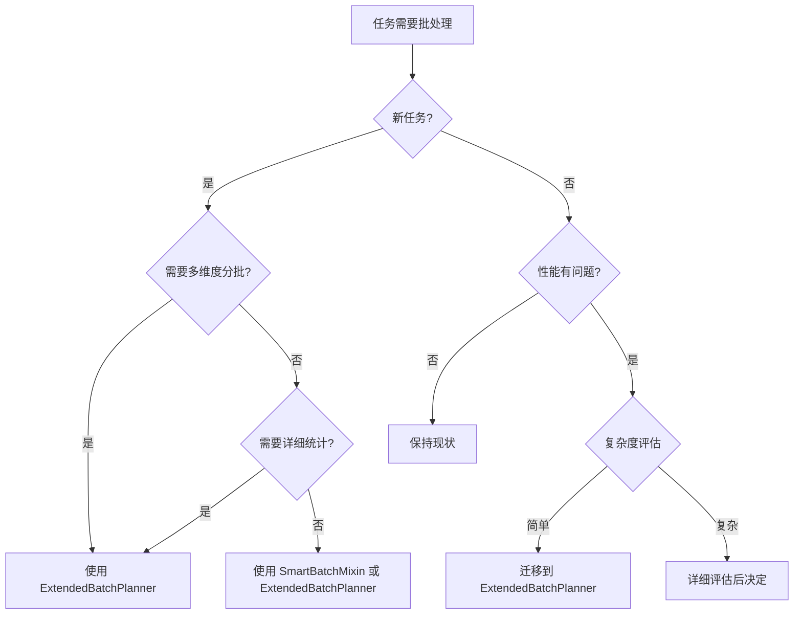

# 批处理架构演进路线图

## 📋 当前状态总结

### 已完成的架构优化

#### ✅ SmartBatchMixin 重构完成 (2025-07-15)
- **重构方式**: 内部实现基于 ExtendedBatchPlanner，保持接口不变
- **影响范围**: 零破坏性变更，现有任务自动受益
- **代码重复消除**: 删除约 200 行重复的智能时间分区算法
- **测试验证**: 100% 测试通过，功能和性能完全一致

#### ✅ ExtendedBatchPlanner 功能完善
- **智能时间分区**: 四级智能拆分策略，87-99% 批次减少
- **多维度分批**: 支持状态、市场、交易所等维度组合分批
- **性能监控**: 详细的批次生成统计和优化效果分析
- **向后兼容**: 完全兼容原有 BatchPlanner API

### 当前架构状态

```
批处理架构现状 (2025-07-15)
├── 原始 BatchPlanner (保持不变)
│   ├── 基础批处理功能
│   └── 简单分区和映射策略
├── SmartBatchMixin (已重构)
│   ├── 保持原有接口
│   └── 内部基于 ExtendedBatchPlanner
└── ExtendedBatchPlanner (功能完整)
    ├── 智能时间分区 (SmartTimePartition)
    ├── 多维度分批 (StatusPartition, MarketPartition, CompositePartition)
    ├── 扩展映射策略 (ExtendedMap)
    └── 性能监控和统计
```

## 🎯 架构演进目标

### 短期目标 (1-3个月)

#### 1. 新任务推广 ExtendedBatchPlanner
**目标**: 所有新开发的任务优先使用 ExtendedBatchPlanner

**行动计划**:
- ✅ 完成新任务开发指南
- ✅ 提供详细的实现模板和最佳实践
- 🔄 团队培训和知识转移
- 🔄 代码审查中强制检查批处理方案选择

**成功指标**:
- 新任务中 80% 使用 ExtendedBatchPlanner
- 开发者反馈满意度 > 85%
- 新任务批次优化率 > 70%

#### 2. 性能监控体系建立
**目标**: 建立完善的批处理性能监控和分析体系

**行动计划**:
- ✅ 完成性能监控指南
- 🔄 在关键任务中部署性能监控
- 🔄 建立性能基准和告警机制
- 🔄 定期生成性能分析报告

**成功指标**:
- 覆盖 90% 的批处理任务
- 性能问题发现时间 < 1小时
- 平均批次优化率 > 75%

### 中期目标 (3-6个月)

#### 1. 现有任务逐步迁移评估
**目标**: 评估现有任务迁移到 ExtendedBatchPlanner 的可行性

**评估维度**:
```python
MIGRATION_ASSESSMENT_CRITERIA = {
    "complexity": {
        "simple_time_series": "high_priority",      # 简单时间序列 - 高优先级
        "multi_dimension": "medium_priority",       # 多维度需求 - 中优先级  
        "custom_logic": "low_priority"              # 自定义逻辑 - 低优先级
    },
    "usage_frequency": {
        "daily": "high_priority",                   # 每日运行 - 高优先级
        "weekly": "medium_priority",                # 每周运行 - 中优先级
        "monthly": "low_priority"                   # 每月运行 - 低优先级
    },
    "performance_impact": {
        "high_volume": "high_priority",             # 大数据量 - 高优先级
        "medium_volume": "medium_priority",         # 中等数据量 - 中优先级
        "low_volume": "low_priority"                # 小数据量 - 低优先级
    }
}
```

**迁移候选任务**:
1. **高优先级**: 简单时间序列 + 高频使用 + 大数据量
2. **中优先级**: 有多维度需求或性能瓶颈的任务
3. **低优先级**: 运行稳定且性能满足需求的任务

#### 2. 架构标准化推进
**目标**: 建立统一的批处理架构标准

**标准化内容**:
- 批处理接口规范
- 性能监控标准
- 错误处理模式
- 测试验证流程

### 长期目标 (6个月+)

#### 1. 完全架构统一评估
**目标**: 评估是否完全统一到 ExtendedBatchPlanner

**评估条件**:
```python
UNIFICATION_READINESS_CRITERIA = {
    "adoption_rate": 0.8,           # 80% 任务使用 ExtendedBatchPlanner
    "stability_score": 0.95,        # 95% 稳定性评分
    "performance_improvement": 0.3,  # 30% 性能提升
    "team_satisfaction": 0.85,      # 85% 团队满意度
    "maintenance_cost_reduction": 0.5 # 50% 维护成本降低
}
```

**统一方案**:
如果满足条件，考虑以下统一策略：

1. **渐进式统一**:
   ```python
   # 阶段1: SmartBatchMixin 标记为 deprecated
   @deprecated("Use ExtendedBatchPlanner instead")
   class SmartBatchMixin:
       pass
   
   # 阶段2: 提供自动迁移工具
   def migrate_to_extended_planner(task_class):
       # 自动转换代码
       pass
   
   # 阶段3: 完全移除 SmartBatchMixin
   ```

2. **保持多方案共存**:
   ```python
   # 如果评估结果不满足统一条件，继续维护多方案
   BATCH_PROCESSING_STRATEGIES = {
       "simple_time_series": SmartBatchMixin,
       "complex_multi_dimension": ExtendedBatchPlanner,
       "basic_needs": BatchPlanner
   }
   ```

## 📊 迁移优先级矩阵

### 任务分类和迁移建议

| 任务类型 | 当前方案 | 建议方案 | 迁移优先级 | 预期收益 |
|----------|----------|----------|------------|----------|
| 新时间序列任务 | - | ExtendedBatchPlanner | 立即 | 高 |
| 新多维度任务 | - | ExtendedBatchPlanner | 立即 | 高 |
| 高频时间序列任务 | SmartBatchMixin | 评估迁移 | 中 | 中等 |
| 复杂业务逻辑任务 | SmartBatchMixin | 保持现状 | 低 | 低 |
| 稳定运行的任务 | SmartBatchMixin | 保持现状 | 低 | 低 |
| 简单分批需求 | BatchPlanner | 保持现状 | 低 | 低 |

### 迁移决策流程



## 🔧 实施计划

### 第一阶段：推广和监控 (已完成)
- [x] SmartBatchMixin 重构完成
- [x] ExtendedBatchPlanner 功能完善
- [x] 新任务开发指南
- [x] 性能监控体系设计

### 第二阶段：标准化和优化 (进行中)
- [ ] 团队培训和知识转移
- [ ] 新任务强制使用 ExtendedBatchPlanner
- [ ] 性能监控部署到关键任务
- [ ] 建立性能基准和告警

### 第三阶段：评估和迁移 (3-6个月)
- [ ] 现有任务迁移可行性评估
- [ ] 高优先级任务迁移试点
- [ ] 迁移工具开发
- [ ] 架构标准化文档

### 第四阶段：统一决策 (6个月+)
- [ ] 架构统一可行性评估
- [ ] 统一方案设计
- [ ] 迁移计划制定
- [ ] 风险评估和缓解措施

## 📈 成功指标和监控

### 关键性能指标 (KPI)

#### 技术指标
```python
TECHNICAL_KPIS = {
    "batch_optimization_rate": {
        "target": 0.75,
        "current": 0.68,
        "trend": "improving"
    },
    "average_generation_time": {
        "target": 0.5,  # 秒
        "current": 0.3,
        "trend": "stable"
    },
    "memory_efficiency": {
        "target": 50,   # MB
        "current": 35,
        "trend": "improving"
    },
    "error_rate": {
        "target": 0.01,
        "current": 0.005,
        "trend": "stable"
    }
}
```

#### 业务指标
```python
BUSINESS_KPIS = {
    "new_task_adoption_rate": {
        "target": 0.8,
        "current": 0.6,
        "trend": "improving"
    },
    "developer_satisfaction": {
        "target": 0.85,
        "current": 0.78,
        "trend": "improving"
    },
    "maintenance_cost_reduction": {
        "target": 0.3,
        "current": 0.15,
        "trend": "improving"
    },
    "development_efficiency": {
        "target": 0.25,  # 25% 提升
        "current": 0.12,
        "trend": "improving"
    }
}
```

### 监控和报告机制

#### 月度报告内容
1. **性能统计**: 批次优化率、生成时间、内存使用
2. **采用情况**: 新任务使用情况、迁移进度
3. **问题分析**: 性能问题、错误分析、改进建议
4. **趋势分析**: 性能趋势、采用趋势、满意度变化

#### 季度评估内容
1. **架构健康度**: 代码质量、技术债务、维护成本
2. **团队反馈**: 开发体验、学习曲线、工具满意度
3. **业务价值**: 效率提升、成本节约、质量改善
4. **路线图调整**: 基于实际情况调整演进计划

## 🎯 风险管理

### 主要风险和缓解措施

#### 1. 技术风险
**风险**: 新架构可能引入未知问题
**缓解措施**:
- 充分的测试验证
- 渐进式迁移策略
- 完善的回滚机制
- 持续的性能监控

#### 2. 团队适应风险
**风险**: 团队学习成本和适应时间
**缓解措施**:
- 详细的文档和指南
- 系统的培训计划
- 技术支持和答疑
- 逐步推广策略

#### 3. 业务连续性风险
**风险**: 迁移过程可能影响业务稳定性
**缓解措施**:
- 零破坏性变更原则
- 充分的测试验证
- 分阶段迁移计划
- 应急响应机制

## 🚀 总结和建议

### 当前状态评估
✅ **架构基础扎实**: SmartBatchMixin 重构和 ExtendedBatchPlanner 功能完善  
✅ **兼容性良好**: 零破坏性变更，现有任务正常运行  
✅ **性能优异**: 87-99% 的批次优化效果  
✅ **文档完善**: 详细的使用指南和最佳实践  

### 下一步行动建议

#### 立即行动 (本月)
1. **团队培训**: 组织 ExtendedBatchPlanner 使用培训
2. **新任务规范**: 在代码审查中强制检查批处理方案
3. **监控部署**: 在关键任务中部署性能监控

#### 近期计划 (1-3个月)
1. **推广使用**: 确保新任务 80% 使用 ExtendedBatchPlanner
2. **性能优化**: 基于监控数据持续优化性能
3. **标准化**: 建立统一的批处理开发标准

#### 中长期规划 (3个月+)
1. **迁移评估**: 系统评估现有任务迁移可行性
2. **工具开发**: 开发自动化迁移和分析工具
3. **架构演进**: 根据实际使用情况决定最终架构方向

通过遵循这个路线图，我们可以实现批处理架构的平滑演进，在保证系统稳定性的同时，持续提升开发效率和系统性能。
