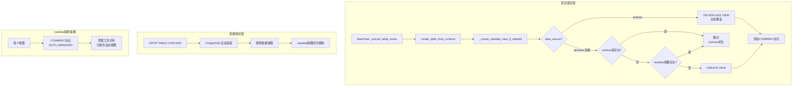

# rawdata Schema 自动视图映射方案

## 核心设计决策（基于用户明确选择）

1. **优先级切换**：`auto_replace` - tushare 创建表时自动 `OR REPLACE` 视图，覆盖其他数据源
2. **删除回退**：`no_fallback` - 删除源表时，rawdata 视图一并删除，不自动指向其他源
3. **rawdata 隔离**：`exclusive_auto` - rawdata 仅存放自动生成的映射视图（通过 COMMENT 标记）
4. **删除安全性**：`simple_cascade` - 直接使用 `DROP TABLE ... CASCADE`，信任数据库清理机制

## PostgreSQL 行为纠正

**关键修正**（针对原计划的不准确描述）：

1. ✅ **视图依赖是自动追踪的**：`CREATE VIEW` 会在 `pg_depend` 中记录对源表的依赖
2. ✅ **CASCADE 会删除依赖视图**：`DROP TABLE ... CASCADE` 会自动删除依赖的视图
3. ⚠️ **不带 CASCADE 会报错**：如果有视图依赖源表，`DROP TABLE`（不带 CASCADE）会失败
4. ⚠️ **CASCADE 可能误伤**：会删除所有依赖对象，不仅限于 rawdata 视图（需要 rawdata 隔离策略）

## 技术实现方案

### 方案架构流程图



### PostgreSQL 原生依赖机制

**关键理解**（修正原方案误解）：

PostgreSQL 的 `CREATE VIEW` **会自动**在 `pg_depend` 系统表中记录依赖关系：

```sql
-- 创建视图时，PostgreSQL 自动记录依赖
CREATE VIEW rawdata.stock_daily AS SELECT * FROM tushare.stock_daily;
-- 在 pg_depend 中记录：rawdata.stock_daily 依赖 tushare.stock_daily

-- 尝试不带 CASCADE 删除会失败
DROP TABLE tushare.stock_daily;
-- ERROR: cannot drop table tushare.stock_daily because other objects depend on it
-- DETAIL: view rawdata.stock_daily depends on table tushare.stock_daily
-- HINT: Use DROP ... CASCADE to drop the dependent objects too.

-- 使用 CASCADE 删除会连带删除视图
DROP TABLE tushare.stock_daily CASCADE;
-- NOTICE: drop cascades to view rawdata.stock_daily
-- 视图被自动删除
```

**结论**：不需要额外代码实现"依赖追踪"，只需确保删除时使用 `CASCADE`。

## 实施文件清单

### 1. 数据库组件增强

**文件**: [`alphahome/common/db_components/schema_management_mixin.py`](alphahome/common/db_components/schema_management_mixin.py)

**关键修改**：现有 `create_view()` 方法只支持同 schema 内建视图，需要增强为跨 schema 支持。

**新增方法**：

```python
async def create_rawdata_view(
    self,
    view_name: str,
    source_schema: str,
    source_table: str,
    replace: bool = False
) -> None:
    """
    在 rawdata schema 创建跨 schema 的映射视图
    
    Args:
        view_name: 视图名称（通常与源表同名）
        source_schema: 源表所在 schema（tushare/akshare/ifind等）
        source_table: 源表名称
        replace: 是否使用 OR REPLACE（tushare 专用）
    
    注意：
 - PostgreSQL 会自动追踪视图对源表的依赖（pg_depend）
 - 删除源表时使用 CASCADE 会自动删除此视图
    """
    await self.ensure_schema_exists('rawdata')
    
    replace_clause = "OR REPLACE " if replace else ""
    
    create_view_sql = f"""
    CREATE {replace_clause}VIEW rawdata."{view_name}" AS
    SELECT * FROM {source_schema}."{source_table}";
    
    COMMENT ON VIEW rawdata."{view_name}" IS 
    'AUTO_MANAGED: source={source_schema}.{source_table}, priority={self._get_priority(source_schema)}';
    """
    
    await self.db.execute(create_view_sql)

async def check_table_exists(
    self, 
    schema: str, 
    table_name: str
) -> bool:
    """
    检查指定 schema 中的表是否存在
    
    注意：复用或改进现有逻辑，避免重复实现
    """
    query = """
    SELECT EXISTS (
        SELECT 1 FROM pg_tables 
        WHERE schemaname = $1 AND tablename = $2
    )
    """
    return await self.db.fetchval(query, schema, table_name)
```

**现有方法复用**：

- ✅ `view_exists(schema, view_name)` - 已存在，直接使用
- ✅ `ensure_schema_exists(schema)` - 已存在，直接使用

### 2. BaseTask 集成

**文件**: [`alphahome/common/task_system/base_task.py`](alphahome/common/task_system/base_task.py)

**修改位置**: 在 `_ensure_table_exists()` 方法中，`_create_table()` 调用之后添加视图创建逻辑

**关键代码**：

```python
async def _ensure_table_exists(self):
    """确保数据表存在（修改后的版本）"""
    # ... 现有的表检查和创建逻辑 ...
    
    # 表创建完成后，自动创建 rawdata 视图
    await self._create_rawdata_view_if_needed()

async def _create_rawdata_view_if_needed(self):
    """
    根据数据源优先级自动创建/更新 rawdata 视图
    
    策略（基于用户选择）：
 1. tushare: 总是创建 OR REPLACE VIEW（覆盖任何已存在的视图）
 2. 其他源: 仅当 tushare 不存在 且 rawdata 视图不存在时才创建
    """
    schema = self.get_table_schema()  # 例如 'tushare', 'akshare'
    table = self.get_table_name()     # 例如 'stock_basic'
    
    # tushare 优先：总是创建/替换
    if self.data_source == 'tushare':
        try:
            await self.db_manager.create_rawdata_view(
                view_name=table,
                source_schema=schema,
                source_table=table,
                replace=True  # OR REPLACE
            )
            self.logger.info(
                f"已为 tushare.{table} 创建 rawdata 视图（优先级覆盖）"
            )
        except Exception as e:
            self.logger.warning(
                f"创建 rawdata 视图失败（不影响数据采集）: {e}"
            )
        return
    
    # 非 tushare 源：检查 tushare 是否已有同名表
    try:
        tushare_exists = await self.db_manager.check_table_exists(
            'tushare', table
        )
        if tushare_exists:
            self.logger.info(
                f"跳过 {schema}.{table} 的 rawdata 视图创建：tushare 优先"
            )
            return
        
        # 检查 rawdata 视图是否已存在
        view_exists = await self.db_manager.view_exists('rawdata', table)
        if view_exists:
            self.logger.info(
                f"rawdata.{table} 视图已存在，跳过创建"
            )
            return
        
        # 创建视图
        await self.db_manager.create_rawdata_view(
            view_name=table,
            source_schema=schema,
            source_table=table,
            replace=False
        )
        self.logger.info(
            f"已为 {schema}.{table} 创建 rawdata 视图"
        )
    except Exception as e:
        self.logger.warning(
            f"创建 rawdata 视图时出错（不影响数据采集）: {e}"
        )
```

**错误处理策略**：视图创建失败不应中断数据采集任务，只记录警告日志。

### 3. 系统初始化

**文件**: [`alphahome/fetchers/main.py`](alphahome/fetchers/main.py) 或系统启动文件

**添加位置**：在系统启动时，数据库连接建立后

**初始化代码**：

```python
async def initialize_rawdata_schema():
    """
    系统启动时确保 rawdata schema 存在并添加文档说明
    
    此方法应在所有 fetcher 任务启动前调用
    """
    db_manager = DatabaseManager()
    
    # 创建 rawdata schema
    await db_manager.ensure_schema_exists('rawdata')
    
    # 添加 schema 级别的文档说明
    comment_sql = """
    COMMENT ON SCHEMA rawdata IS 
    '自动管理的统一数据视图层。
    
    规则：
 1. 本 schema 仅包含自动生成的映射视图（通过 COMMENT 标记）
 2. 禁止手动创建表或视图
 3. 数据源优先级：tushare > akshare > 其他
 4. 删除源表时，对应视图自动删除（CASCADE）
    
    查询示例：SELECT * FROM rawdata.stock_basic;
    ';
    """
    await db_manager.db.execute(comment_sql)
    
    logger.info("rawdata schema 初始化完成")

# 在 main() 函数中调用
async def main():
    # ... 现有初始化代码 ...
    
    # 初始化 rawdata schema
    await initialize_rawdata_schema()
    
    # ... 启动 fetcher 任务 ...
```

### 4. 批量迁移脚本（为现有表创建视图）

**新文件**: [`scripts/migrate_existing_tables_to_rawdata.py`](scripts/migrate_existing_tables_to_rawdata.py)

**功能**：为已存在的所有数据表批量创建 rawdata 视图

**核心逻辑**：

```python
async def migrate_existing_tables():
    """
    扫描所有数据源 schema，为现有表创建 rawdata 视图
    
    按优先级处理：tushare -> akshare -> 其他
    """
    db_manager = DatabaseManager()
    
    # 数据源优先级（从高到低）
    schemas = ['tushare', 'akshare', 'ifind', 'pytdx']
    created_views = []
    skipped_views = []
    
    for schema in schemas:
        tables = await db_manager.get_tables_in_schema(schema)
        
        for table in tables:
            view_name = table
            
            # tushare：总是创建/覆盖
            if schema == 'tushare':
                await db_manager.create_rawdata_view(
                    view_name=view_name,
                    source_schema=schema,
                    source_table=table,
                    replace=True
                )
                created_views.append(f"rawdata.{view_name} -> tushare.{table}")
                continue
            
            # 其他源：检查是否已有视图
            if await db_manager.view_exists('rawdata', view_name):
                skipped_views.append(
                    f"{schema}.{table} (rawdata.{view_name} 已存在)"
                )
                continue
            
            # 创建视图
            await db_manager.create_rawdata_view(
                view_name=view_name,
                source_schema=schema,
                source_table=table,
                replace=False
            )
            created_views.append(f"rawdata.{view_name} -> {schema}.{table}")
    
    # 生成报告
    print(f"\n=== 迁移完成 ===")
    print(f"创建视图: {len(created_views)}")
    print(f"跳过: {len(skipped_views)}")
    
    # 详细列表
    print("\n创建的视图:")
    for view in created_views:
        print(f"  - {view}")
    
    if skipped_views:
        print("\n跳过的表:")
        for skip in skipped_views:
            print(f"  - {skip}")
```

**使用方式**：

```bash
# 运行一次性迁移
python scripts/migrate_existing_tables_to_rawdata.py
```

### 5. 删除处理（简化方案）

**策略**：基于用户选择的 `simple_cascade`，直接使用 PostgreSQL 原生 `CASCADE` 机制

**无需额外代码**：删除表时使用标准 SQL：

```sql
DROP TABLE schema_name.table_name CASCADE;
```

PostgreSQL 会自动：

1. 检查 `pg_depend` 中的依赖关系
2. 删除所有依赖的视图（包括 rawdata 中的映射视图）
3. 保证原子性操作

**文档说明**（添加到用户手册）：

````markdown
## 删除数据表的注意事项

删除包含 rawdata 映射视图的表时，**必须**使用 CASCADE 选项：

```sql
-- ✅ 正确：会同时删除 rawdata 视图
DROP TABLE tushare.stock_basic CASCADE;

-- ❌ 错误：会报错（因为有视图依赖）
DROP TABLE tushare.stock_basic;
-- ERROR: cannot drop table tushare.stock_basic because other objects depend on it
-- DETAIL: view rawdata.stock_basic depends on table tushare.stock_basic
````

CASCADE 会删除所有依赖对象，因此：

- rawdata schema 应保持"仅自动视图"的隔离策略
- 删除前建议先查看依赖：`\d+ schema.table` (psql) 或查询 pg_depend

````

**可选工具**（如需要更安全的删除体验）：

可以创建一个辅助脚本 [`scripts/drop_table_with_cascade.py`](scripts/drop_table_with_cascade.py)，但这不是必需的，因为 SQL 已足够简单。

## 详细实现要点

### 优先级规则实现

**数据源优先级定义**（可配置）：

```python
# alphahome/common/constants.py（或现有配置文件）
DATA_SOURCE_PRIORITY = {
    'tushare': 1,   # 最高优先级（主数据源）
    'akshare': 2,   # 备用数据源
    'ifind': 3,     # 其他数据源
    'pytdx': 4,
}
```

**tushare 优先的"稳健性"实现**（针对用户反馈）：

```python
# 非 tushare 源创建视图前的双重检查
async def _create_rawdata_view_if_needed(self):
    if self.data_source != 'tushare':
        # 检查1: tushare 表是否存在
        tushare_exists = await self.db_manager.check_table_exists(
            'tushare', self.get_table_name()
        )
        if tushare_exists:
            return  # tushare 优先，跳过
        
        # 检查2: rawdata 视图是否已存在
        view_exists = await self.db_manager.view_exists(
            'rawdata', self.get_table_name()
        )
        if view_exists:
            return  # 已有视图，跳过
        
        # 检查3（可选，防竞态）: 再次确认 tushare 不存在
        # 适用于并发创建表的场景
        tushare_exists = await self.db_manager.check_table_exists(
            'tushare', self.get_table_name()
        )
        if tushare_exists:
            return  # 并发竞态保护
```

### COMMENT 标记策略（rawdata 隔离）

每个自动创建的视图都添加标准化的 COMMENT：

```sql
COMMENT ON VIEW rawdata."stock_basic" IS 
'AUTO_MANAGED: source=tushare.stock_basic, priority=1, created=2025-01-15T10:30:00';
```

**管理工具识别方式**：

```python
async def get_auto_managed_views(self) -> List[Dict]:
    """获取所有自动管理的视图"""
    query = """
    SELECT 
        table_name,
        obj_description((quote_ident(table_schema) || '.' || quote_ident(table_name))::regclass) as comment
    FROM information_schema.views
    WHERE table_schema = 'rawdata'
      AND obj_description((quote_ident(table_schema) || '.' || quote_ident(table_name))::regclass) LIKE 'AUTO_MANAGED:%'
    """
    return await self.db.fetch(query)
```

### 错误处理与日志

**关键原则**：视图管理失败不应中断核心数据采集流程

```python
# BaseTask 中的错误处理
try:
    await self._create_rawdata_view_if_needed()
except Exception as e:
    self.logger.warning(
        f"rawdata 视图创建失败，但数据表已成功创建，不影响数据采集。"
        f"错误: {e}"
    )
    # 不抛出异常，继续执行
```

**日志级别**：

- `INFO`: 视图创建成功、跳过（优先级原因）
- `WARNING`: 视图创建失败（不中断流程）
- `ERROR`: 数据库连接失败等严重问题

## 测试验证计划

### 测试场景1：tushare 优先覆盖

**目标**：验证 tushare 创建表时自动覆盖已存在的 rawdata 视图

```python
# 步骤1: 创建 akshare.stock_basic 表
# 预期：自动创建 rawdata.stock_basic 视图指向 akshare

# 步骤2: 创建 tushare.stock_basic 表
# 预期：自动 OR REPLACE rawdata.stock_basic 视图，现在指向 tushare

# 步骤3: 验证
psql -d alphadb -c """
SELECT 
    view_definition 
FROM information_schema.views 
WHERE table_schema='rawdata' AND table_name='stock_basic';
"""
# 预期输出应包含 "FROM tushare.stock_basic"
```

### 测试场景2：CASCADE 删除

**目标**：验证删除源表时，rawdata 视图自动被删除

```sql
-- 步骤1: 创建测试表和视图
CREATE TABLE tushare.test_cascade (id INT);
CREATE VIEW rawdata.test_cascade AS SELECT * FROM tushare.test_cascade;

-- 步骤2: 验证视图存在
SELECT * FROM rawdata.test_cascade;  -- 应该成功

-- 步骤3: 删除源表（不带 CASCADE 应报错）
DROP TABLE tushare.test_cascade;
-- 预期：ERROR: cannot drop table ... because other objects depend on it

-- 步骤4: 使用 CASCADE 删除
DROP TABLE tushare.test_cascade CASCADE;
-- 预期：NOTICE: drop cascades to view rawdata.test_cascade

-- 步骤5: 验证视图已删除
SELECT * FROM rawdata.test_cascade;  
-- 预期：ERROR: relation "rawdata.test_cascade" does not exist
```

### 测试场景3：优先级保护

**目标**：验证 tushare 存在时，其他数据源不会创建视图

```python
# 步骤1: 先创建 tushare.fund_basic
# 预期：rawdata.fund_basic 指向 tushare

# 步骤2: 尝试创建 akshare.fund_basic
# 预期：日志显示"跳过创建（tushare 优先）"，视图保持指向 tushare

# 步骤3: 验证
psql -d alphadb -c """
SELECT 
    pg_get_viewdef('rawdata.fund_basic'::regclass) 
"""
# 预期输出应仍然是 "FROM tushare.fund_basic"
```

### 测试场景4：COMMENT 标记验证

**目标**：验证自动创建的视图都有正确的 COMMENT 标记

```sql
SELECT 
    table_name,
    obj_description((quote_ident(table_schema) || '.' || quote_ident(table_name))::regclass) as comment
FROM information_schema.views
WHERE table_schema = 'rawdata'
LIMIT 5;

-- 预期输出：每个视图的 comment 应包含 "AUTO_MANAGED: source=..."
```

## 实施步骤与时间估算

### 阶段1：核心功能实现（60-90分钟）

1. **schema_management_mixin.py 增强**（30分钟）

            - 添加 `create_rawdata_view()` 方法（跨 schema 支持）
            - 添加 `check_table_exists()` 方法
            - 测试方法可用性

2. **base_task.py 集成**（30分钟）

            - 在 `_ensure_table_exists()` 中添加视图创建调用
            - 实现 `_create_rawdata_view_if_needed()` 方法
            - 添加错误处理和日志

3. **系统初始化**（15分钟）

            - 在 `fetchers/main.py` 添加 `initialize_rawdata_schema()`
            - 添加 schema 文档说明

### 阶段2：批量迁移与工具（45-60分钟）

4. **批量迁移脚本**（45分钟）

            - 编写 `migrate_existing_tables_to_rawdata.py`
            - 实现按优先级扫描和创建逻辑
            - 生成迁移报告

### 阶段3：测试验证（30-45分钟）

5. **集成测试**（30分钟）

            - 测试 tushare 优先覆盖场景
            - 测试 CASCADE 删除行为
            - 测试优先级保护机制
            - 验证 COMMENT 标记

6. **文档更新**（15分钟）

            - 更新用户手册，说明 rawdata 使用方法
            - 添加删除表的注意事项（必须使用 CASCADE）

**总预计时间**：2.5 - 3.5 小时

### 风险点与缓解

| 风险 | 影响 | 缓解策略 |

|------|------|---------|

| 视图创建失败中断数据采集 | 高 | ✅ 已处理：try-catch，不抛出异常 |

| CASCADE 误删其他依赖对象 | 中 | ✅ 已处理：rawdata 隔离策略 + COMMENT 标记 |

| 并发竞态（同时创建多个源的同名表） | 低 | ✅ 已处理：双重检查逻辑 |

| 迁移脚本性能问题（表太多） | 低 | 批量操作 + 异步执行 |

## 关键修正总结（基于用户反馈）

### PostgreSQL 行为纠正

**原计划误解** → **实际行为**：

1. ❌ "CREATE VIEW 不会建立 CASCADE 依赖" → ✅ **会自动记录依赖（pg_depend）**
2. ❌ "需要额外代码实现依赖追踪" → ✅ **PostgreSQL 原生支持，无需额外代码**
3. ❌ "CASCADE 删除需要手动清理视图" → ✅ **数据库自动删除依赖视图**

### 实现层面关键改进

**基于用户建议的优化**：

1. ✅ **复用现有方法**：使用已存在的 `view_exists()`，避免 `check_view_exists()` 重复
2. ✅ **跨 schema 支持**：新增 `create_rawdata_view()` 支持 `FROM {source_schema}.{table}`
3. ✅ **tushare 优先稳健性**：非 tushare 源创建前检查 tushare 表是否存在（防竞态）
4. ✅ **rawdata 隔离**：通过 COMMENT 标记自动管理的视图，管理工具只操作标记对象
5. ✅ **删除安全性**：直接使用 `DROP TABLE ... CASCADE`，信任数据库机制

### 边界情况处理

| 场景 | 策略（基于用户选择） |

|------|-------------------|

| tushare 表已存在时创建 akshare 同名表 | 跳过视图创建，保持 rawdata 指向 tushare |

| 删除 tushare 表后 akshare 同名表仍存在 | 视图被删除，**不自动回退**到 akshare（no_fallback） |

| rawdata 中有手动创建的对象 | **不允许**（exclusive_auto），仅自动视图 |

| CASCADE 删除影响其他依赖对象 | **接受风险**（simple_cascade），依赖 rawdata 隔离策略 |

## 方案优势

1. **完全自动化**：开发者创建表时无需关心视图，系统自动处理
2. **零存储开销**：视图不占用额外存储空间
3. **统一查询接口**：所有查询统一使用 `rawdata.table_name`
4. **利用原生机制**：完全依赖 PostgreSQL 内置的依赖管理，不引入额外复杂度
5. **tushare 优先明确**：数据源优先级规则清晰，避免混淆

## 潜在局限

1. **删除不可逆**：删除源表后视图消失，需重新运行 fetcher 重建（符合 no_fallback 策略）
2. **数据库绑定**：方案依赖 PostgreSQL 特性，不易迁移到其他数据库
3. **CASCADE 风险**：如果 rawdata 隔离策略未严格执行，可能误删其他对象
4. **并发竞态**：极端情况下多个源同时创建同名表可能有竞态（已通过双重检查缓解）

## 后续优化方向

1. **监控告警**：监控 rawdata schema 对象变更，检测违规手动创建的对象
2. **视图诊断工具**：检测"孤儿视图"（源表已删除但视图仍存在的异常情况）
3. **性能优化**：为高频查询的视图考虑物化视图（MATERIALIZED VIEW）
4. **事件触发器**：考虑使用 PostgreSQL DDL event trigger 实现更高级的自动化（权限要求高）