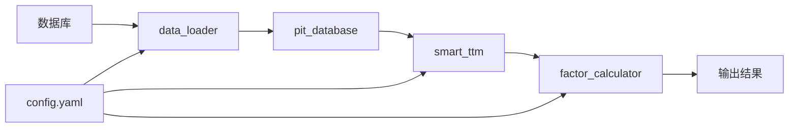
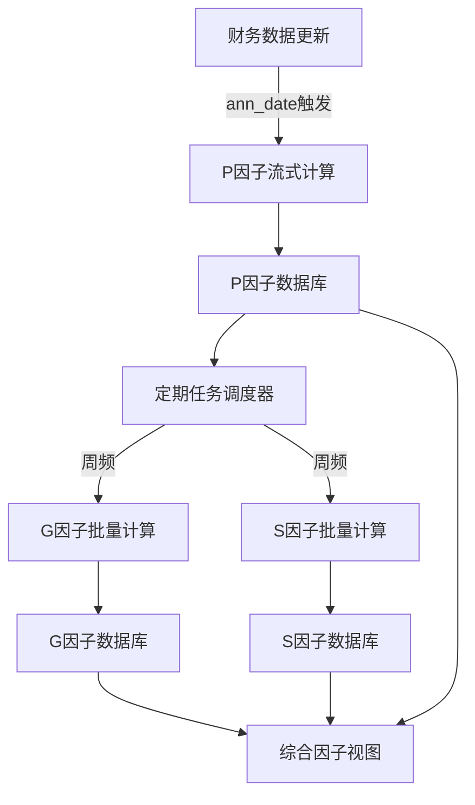

# P/G/S因子计算系统架构说明

## 📁 目录结构

```
research/pgs_factor/
│
├── 📄 config.yaml              # 系统配置文件（核心）
├── 📘 main.py                  # 主程序入口（简化接口）
├── 📦 __init__.py              # 模块初始化
│
├── 🔧 核心组件/
│   ├── data_loader.py         # 数据加载器
│   ├── pit_database.py        # 时间点数据库
│   ├── smart_ttm.py           # 智能TTM计算
│   ├── cumulative_handler.py  # 累积值处理器
│   ├── g_factor_new.py        # 新G因子计算模块
│   └── factor_calculator.py   # 因子计算器
│
├── 📚 文档/
│   ├── README.md              # 使用说明
│   └── structure.md           # 架构说明（本文件）
│
└── 🧪 示例/
    └── example_usage.py       # 使用示例

```

## 🏗️ 系统架构

### 1. 配置层（config.yaml）
- **数据源配置**：定义所有数据表名称
- **字段映射**：数据库实际字段名映射
- **因子配置**：P/G/S各指标权重和参数
- **计算参数**：TTM、标准化、中性化等参数
- **输出配置**：输出格式和目录设置

### 2. 数据层
- **data_loader.py**：负责从数据库加载原始数据
  - 财务报表数据
  - 市场行情数据
  - 业绩预告和快报
  
- **pit_database.py**：管理时间点数据
  - 确保数据的时间点准确性
  - 防止未来函数
  - 管理数据版本

### 3. 计算层
- **smart_ttm.py**：智能TTM计算
  - 融合正式财报、快报、预告
  - 处理数据缺失
  - 优化TTM精度
  
- **factor_calculator.py**：因子计算核心
  - P因子：盈利能力指标
  - G因子：成长能力指标（基于P_score变化）
  - S因子：安全能力指标
  - 因子后处理（标准化、中性化）

### 4. 接口层
- **main.py**：统一的用户接口
  - 命令行接口
  - 单日/批量计算
  - 结果保存和报告生成

## 🔄 数据流程



## 🎯 核心功能

### 1. 时间点数据管理
- 避免未来函数
- 确保历史数据的真实性
- 支持数据回测

### 2. 智能TTM计算
- 自动选择最优数据源
  - 处理财报延迟问题
  - 提高实时性
  - 累积值处理

### 3. G因子计算（g_factor_new.py）
- 双因子模型（惊喜因子 + 绝对动量）
- 数据完整性检查（最少12个季度）
- 百分位排名合成

### 3. 因子标准化
- Z-Score标准化
- 分位数标准化
- 极值处理

### 4. 因子中性化
- 行业中性化
- 市值中性化
- 风格中性化

## 💡 使用方式

### 命令行使用
```bash
# 单日计算
python main.py --mode single --date 2024-01-05

# 批量计算（周频）
python main.py --mode batch --start 2024-01-01 --end 2024-03-31 --frequency W

# 指定股票计算
python main.py --mode single --stocks 000001.SZ 000002.SZ 600000.SH

# 使用自定义配置
python main.py --config my_config.yaml --mode single
```

### Python代码使用
```python
from research.pgs_factor.main import PGSFactorSystem

# 创建系统实例
system = PGSFactorSystem()

# 单日计算
factors = system.calculate_single_date('2024-01-05')

# 批量计算
factors = system.calculate_batch('2024-01-01', '2024-03-31', 'W')

# 保存结果
system.save_results(factors, 'my_factors')

# 关闭系统
system.close()
```

## 🔧 配置说明

### 修改数据源
编辑 `config.yaml` 中的 `data_source` 部分：
```yaml
data_source:
  balance_sheet: "your_schema.your_table"
  income_statement: "your_schema.your_table"
```

### 调整因子权重
编辑 `config.yaml` 中的因子配置部分：
```yaml
p_factor:
  indicators:
    - name: "roe_ttm"
      weight: 0.4  # 提高ROE权重
```

### 修改输出格式
编辑 `config.yaml` 中的输出配置：
```yaml
output:
  formats:
    - csv
    - excel  # 添加Excel输出
  compress: false  # 不压缩
```

## 📊 输出说明

### 输出文件
- `pgs_factors_YYYYMMDD_HHMMSS.csv`：因子数据
- `pgs_factors_YYYYMMDD_HHMMSS.pkl`：Python对象
- `pgs_factors_YYYYMMDD_HHMMSS.parquet`：列式存储

### 字段说明
| 字段 | 说明 | 类型 |
|-----|------|-----|
| ts_code | 股票代码 | str |
| calc_date | 计算日期 | date |
| p_score | P因子得分 | float |
| g_score | G因子得分 | float |
| s_score | S因子得分 | float |
| total_score | 综合得分 | float |
| p_rank | P因子排名 | int |
| g_rank | G因子排名 | int |
| s_rank | S因子排名 | int |
| total_rank | 综合排名 | int |
| factor_a | G因子-惊喜 | float |
| factor_b | G因子-动量 | float |
| p_score_yoy | P_score同比 | float |

## 🚀 性能优化

### 并行处理
- 配置 `performance.parallel.enabled: true`
- 设置 `max_workers` 控制并发数

### 缓存机制
- 配置 `performance.cache.enabled: true`
- 缓存有效期：24小时

### 内存管理
- 自动垃圾回收
- 分批处理大数据集

## ⚠️ 注意事项

1. **数据库连接**：确保数据库连接配置正确
2. **表名映射**：检查实际表名和字段名
3. **时间格式**：日期格式统一为 YYYY-MM-DD
4. **股票代码**：格式为 XXXXXX.SZ/SH
5. **内存限制**：大批量计算注意内存使用

## 🔍 问题排查

### 常见问题
1. **字段不存在**：检查 config.yaml 中的字段映射
2. **表不存在**：确认数据源表名正确
3. **内存不足**：减小批处理大小
4. **连接超时**：检查数据库连接参数

### 调试模式
设置日志级别为 DEBUG：
```yaml
logging:
  level: "DEBUG"
```

## 📈 后续优化方向

1. **更多因子**：添加质量因子、动量因子等
2. **机器学习**：因子权重优化
3. **实时计算**：支持实时数据更新
4. **可视化**：添加因子分析图表
5. **回测系统**：集成因子回测功能

## 🚀 下一步计划：全面计算与数据库存储

### 📊 总体架构设计



### 1️⃣ P因子流式计算系统

#### 设计原则
- **事件驱动**：基于财务数据的ann_date（公告日期）触发计算
- **数据分级**：区分正式财报、业绩快报、业绩预告三种数据源
- **增量更新**：仅计算有新数据的股票，避免重复计算

#### 数据库表结构
```sql
-- P因子主表
CREATE TABLE pgs_factors.p_factor (
    id SERIAL PRIMARY KEY,
    ts_code VARCHAR(10) NOT NULL,
    calc_date DATE NOT NULL,
    ann_date DATE NOT NULL,
    data_source VARCHAR(20) NOT NULL, -- 'report'/'express'/'forecast'
    roe_ttm FLOAT,
    roa_ttm FLOAT,
    gross_margin FLOAT,
    p_score FLOAT,
    confidence FLOAT,
    created_at TIMESTAMP DEFAULT CURRENT_TIMESTAMP,
    updated_at TIMESTAMP DEFAULT CURRENT_TIMESTAMP,
    UNIQUE(ts_code, calc_date, data_source)
);

-- 创建索引
CREATE INDEX idx_p_factor_stock_date ON pgs_factors.p_factor(ts_code, calc_date);
CREATE INDEX idx_p_factor_ann_date ON pgs_factors.p_factor(ann_date);
CREATE INDEX idx_p_factor_source ON pgs_factors.p_factor(data_source);
```

#### 流式计算流程
```python
# 伪代码示例
class PFactorStreamProcessor:
    def __init__(self):
        self.last_processed = self.get_last_processed_date()
    
    def process_new_announcements(self):
        # 1. 获取新公告
        new_reports = self.get_new_reports(since=self.last_processed)
        new_express = self.get_new_express(since=self.last_processed)
        new_forecast = self.get_new_forecast(since=self.last_processed)
        
        # 2. 按优先级处理（正式报表 > 快报 > 预告）
        for ann_date, stocks in new_reports.groupby('ann_date'):
            self.calculate_p_factor(stocks, ann_date, 'report')
        
        for ann_date, stocks in new_express.groupby('ann_date'):
            self.calculate_p_factor(stocks, ann_date, 'express')
            
        for ann_date, stocks in new_forecast.groupby('ann_date'):
            self.calculate_p_factor(stocks, ann_date, 'forecast')
        
        # 3. 更新处理进度
        self.update_last_processed()
```

### 2️⃣ G因子和S因子定期计算

#### 调度策略
- **计算频率**：每周五收盘后
- **数据依赖**：使用最新的P因子数据
- **批量处理**：全市场股票统一计算

#### 数据库表结构
```sql
-- G因子表
CREATE TABLE pgs_factors.g_factor (
    id SERIAL PRIMARY KEY,
    ts_code VARCHAR(10) NOT NULL,
    calc_date DATE NOT NULL,
    g_score FLOAT,
    factor_a FLOAT,  -- 惊喜因子
    factor_b FLOAT,  -- 动量因子
    rank_a FLOAT,
    rank_b FLOAT,
    p_score_yoy FLOAT,
    p_score_yoy_pct FLOAT,
    data_periods INT,  -- 使用的历史数据期数
    created_at TIMESTAMP DEFAULT CURRENT_TIMESTAMP,
    UNIQUE(ts_code, calc_date)
);

-- S因子表
CREATE TABLE pgs_factors.s_factor (
    id SERIAL PRIMARY KEY,
    ts_code VARCHAR(10) NOT NULL,
    calc_date DATE NOT NULL,
    s_score FLOAT,
    debt_ratio FLOAT,
    beta FLOAT,
    roe_volatility FLOAT,
    created_at TIMESTAMP DEFAULT CURRENT_TIMESTAMP,
    UNIQUE(ts_code, calc_date)
);

-- 综合因子视图
CREATE VIEW pgs_factors.factor_summary AS
SELECT 
    COALESCE(p.ts_code, g.ts_code, s.ts_code) as ts_code,
    COALESCE(p.calc_date, g.calc_date, s.calc_date) as calc_date,
    p.p_score,
    p.data_source as p_source,
    p.confidence as p_confidence,
    g.g_score,
    g.data_periods as g_data_periods,
    s.s_score,
    -- 综合得分（需要标准化）
    (COALESCE(p.p_score, 0) * 0.4 + 
     COALESCE(g.g_score, 0) * 0.3 + 
     COALESCE(s.s_score, 0) * 0.3) as total_score
FROM pgs_factors.p_factor p
FULL OUTER JOIN pgs_factors.g_factor g 
    ON p.ts_code = g.ts_code AND p.calc_date = g.calc_date
FULL OUTER JOIN pgs_factors.s_factor s
    ON COALESCE(p.ts_code, g.ts_code) = s.ts_code 
    AND COALESCE(p.calc_date, g.calc_date) = s.calc_date;
```

### 3️⃣ 任务调度系统

#### 使用Apache Airflow实现
```python
# airflow DAG示例
from airflow import DAG
from airflow.operators.python_operator import PythonOperator
from datetime import datetime, timedelta

# P因子流式计算DAG（每小时运行）
p_factor_dag = DAG(
    'p_factor_stream',
    default_args={'retries': 2},
    schedule_interval='0 * * * *',  # 每小时
    start_date=datetime(2025, 1, 1),
    catchup=False
)

# G/S因子批量计算DAG（每周五）
gs_factor_dag = DAG(
    'gs_factor_batch',
    default_args={'retries': 2},
    schedule_interval='0 18 * * 5',  # 每周五18:00
    start_date=datetime(2025, 1, 1),
    catchup=False
)
```

### 4️⃣ 数据质量监控

#### 监控指标
- **覆盖率**：有因子数据的股票占比
- **时效性**：数据更新延迟
- **完整性**：各因子缺失率
- **一致性**：不同数据源之间的差异

#### 监控表
```sql
CREATE TABLE pgs_factors.quality_metrics (
    id SERIAL PRIMARY KEY,
    metric_date DATE NOT NULL,
    metric_type VARCHAR(50),
    metric_value FLOAT,
    details JSONB,
    created_at TIMESTAMP DEFAULT CURRENT_TIMESTAMP
);
```

### 5️⃣ 实施步骤

#### Phase 1: 基础设施搭建（第1-2周）
- [ ] 创建数据库schema和表结构
- [ ] 部署Airflow调度系统
- [ ] 建立监控dashboard

#### Phase 2: P因子流式系统（第3-4周）
- [ ] 实现增量数据检测
- [ ] 开发流式计算引擎
- [ ] 数据源优先级管理
- [ ] 单元测试和集成测试

#### Phase 3: G/S因子批量系统（第5-6周）
- [ ] 实现周频批量计算
- [ ] 历史数据回填
- [ ] 性能优化（并行计算）
- [ ] 异常处理机制

#### Phase 4: 监控和优化（第7-8周）
- [ ] 数据质量监控系统
- [ ] 性能监控和报警
- [ ] 自动化运维脚本
- [ ] 文档和培训

### 6️⃣ 技术选型

| 组件 | 技术选择 | 理由 |
|-----|---------|------|
| 数据库 | PostgreSQL | 支持JSON、性能好、扩展性强 |
| 调度器 | Apache Airflow | 成熟、可视化好、易于监控 |
| 消息队列 | Redis/RabbitMQ | 用于P因子事件驱动 |
| 监控 | Grafana + Prometheus | 可视化强、告警灵活 |
| 计算引擎 | Python + Pandas | 现有代码兼容 |
| 并行框架 | Dask/Ray | 大规模并行计算 |

### 7️⃣ 预期收益

1. **实时性提升**：P因子随财报更新实时计算
2. **计算效率**：避免重复计算，资源利用率提升80%
3. **数据追溯**：完整的历史记录，支持回测分析
4. **灵活查询**：支持多维度数据查询和分析
5. **质量保证**：自动化监控，及时发现数据问题
